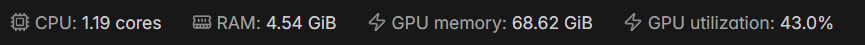
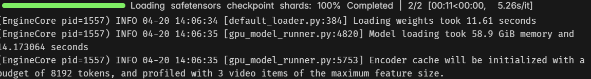
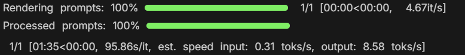

# zarnngemma

A simple Jupyter notebook for running the current state-of-the-art (SOTA) open-source large language model using vLLM.

---

## Overview
This project provides a  practical setup to run Gemma 4 31B (instruction-tuned) using vLLM for fast and efficient inference.

---

## Requirements
- NVIDIA GPU (recommended: A100 80GB or similar with minimun 80GB VRAM)
- CUDA-compatible environment
- Python 3.10+

---

## Attachment
Resource usage and inference speed during model loading and generation.

